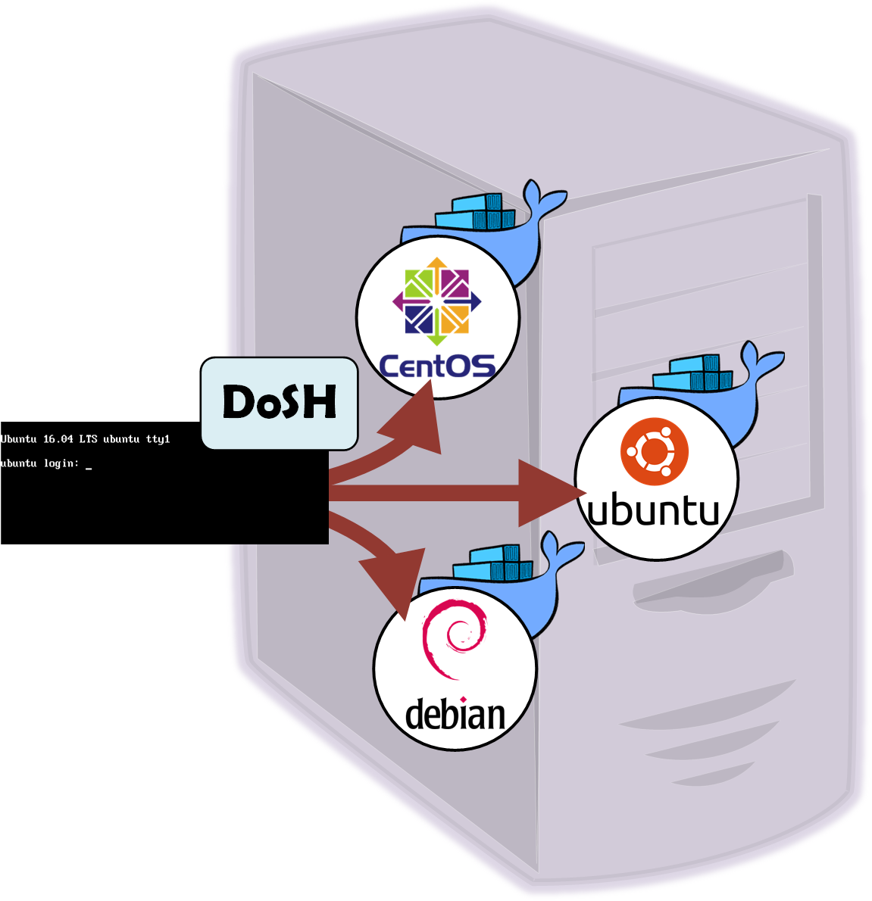

# DoSH - Docker SHell

DoSH (which stands for Docker SHell) is a development to create Docker containers when users log in the Linux system and run a shell into them, instead of symply creating the shell. 

When a user logs-in a Linux server, the system creates a new process (e.g. /bin/bash) for that user [\[1\]](https://www.linuxnix.com/how-login-process-work-in-linux/). DoSH helps you to spawn a customized Docker container of your choice, and to provide a shell to the user _inside the container_ (instead of the main host).

In this way, you can limit the resources that the user is able to use, the applications, etc. but also provide custom linux flavour for each user or group of users (i.e. it will coexist users that have CentOS 7 with Ubuntu 16.04 in the same server).



## Security

**TL;DR:** Using DoSH, the users cannot run arbitrary docker containers. Moreover the containers are forced to get the credentials from the user that logs-in ([details](https://ilearnedhowto.wordpress.com/2017/11/10/how-to-securely-contain-users-using-docker-containers/)). 

The main problem of Docker related to security is that the daemon is running as root. So if I am able to run containers (e.g. I am in the _docker_ group), I am able to run something like this:

```bash
$ docker run --privileged alpine ash -c 'echo 1 > /proc/sys/kernel/sysrq; echo o > /proc/sysrq-trigger'
```

And the host will be powered off as a regular user. Or simply...

```bash
$ docker run --rm -v /etc:/etc -it alpine ash
/ $ adduser mynewroot -G root
...
/ $ exit
```

And once you exit the container, you will have a new root user in the physical host.

This happens because the user inside the container is "root" that has UID=0, and it is root because the Docker daemon is root with UID=0.

The actual problem is that the user needs to be allowed to use Docker to spawn the DoSH container, but you do not want to allow the user to run arbitraty docker commands. In the case of DoSH it is _bypassed_ by allowing the users to run the command that spawn the container as root (by using ```sudo```), but not allowing the users to directly create the containers. Moreover, the container is forced to be spawned with the credentials of the end-user (thus granting him with the actual permissions in the system). You can find more details [in this link](https://ilearnedhowto.wordpress.com/2017/11/10/how-to-securely-contain-users-using-docker-containers/). 

## Installation

In order to install DoSH you can simply get it from the [pre-built packages](), or install from the source

### From Source

If you are a _sysadmin_ you will probably know what DoSH does, and this is your place! The next sections will drive you through the installation procedure from the curious sysadmin perspective.

#### Dependencies

DoSH is built on bash scripting and so there are few dependencies from standard packages appart from [Docker](https://www.docker.com/).

**Ubuntu**

```bash
$ apt-get install bash gettext sudo
```

**CentOS**

```bash
$ yum install bash gettext sudo
```

#### Get the scripts and copy the contents to its places

Now you can get the scripts (you'll need to have _git_ installed):

```bash
$ git clone https://github.com/grycap/dosh
```

The binary scripts must be copied to the ```/bin``` folder, the main configuration file to ```/etc``` and the file ```dosh.sudoers``` to the folder ```/etc/sudoers.d```

```bash
$ cd dosh
$ cp dosh shell2docker /bin
$ cp dosh.conf /etc
$ mkdir -p /etc/sudoers.d
$ cp dosh.sudoers /etc/sudoers.d/dosh
```

Please, take a look at file ```dosh.sudoers``` and get comfortable with it, because this is the key for DoSH to work. It simply allows any user to run the file ```shell2docker``` as root without password. And ```shell2docker``` will create the commandline to run the docker containers, but will also force the container to be run using the user's credentials.

Now you are advised to adjust the permissions of the files (they are a bit strict for users, but we are dealing with security):

```bash
$ mkdir -p /etc/dosh/conf.d
$ chown root:root /etc/sudoers.d/dosh /etc/dosh.conf
$ chown -R root:root /etc/dosh/conf.d
$ chmod 400 /etc/sudoers.d/dosh
$ chmod 600 /etc/dosh.conf
$ chmod -R 700 /etc/dosh/
$ chown root:root /bin/dosh /bin/shell2docker
$ chmod 755 /bin/dosh /bin/shell2docker
```

And now you are ready to use DoSH.

## Using DoSH

To use DoSH, you just need to change the shell to the user that you want to get into the container when he logs-in. E.g. for user ```user1```:

```bash
$ usermod user1 -s /bin/dosh
```

If you want to get your user ```user1``` back to other shell (e.g. bash) you just need to issue a similar command:

```bash
$ usermod user1 -s /bin/bash
```

The effect is very simple, and you can see it in the ```/etc/passwd``` file:

```bash
root@myserver:~$ tail -n 2 /etc/passwd
myuser:x:1001:1001::/home/myuser:/bin/bash
user1:x:1002:1002:,,,:/home/user1:/bin/dosh
root@myserver:~$ 
```

## Configuring DoSH

The configuiration of DoSH is made in the file ```/etc/dosh.conf```. That file contains a lot of description about the configuration of DoSH, but here we explain the most important values to set up when first installing DoSH:

* **CONTAINERIMAGE** is the default image used to create the container for any user.
* **CONTAINERCOMMAND** is the default command used to enter in the container (i.e. the shell that is provided to the user).
* **DOCKERPARAMETERS** are a set of extra parameters to the Docker call, which are injected to the call to the creation of the container

A simple configuration file will be the next:

```bash
CONTAINERIMAGE=ubuntu:latest
CONTAINERCOMMAND=bash
DOCKERPARAMETERS=-v /etc/passwd:/etc/passwd:ro -v /etc/group:/etc/group:ro -v /home/$USER:/home/$USER -w /home/$USER
```

For each user, DoSH will start an _ubuntu_ container, using the _bash_ shell, and the user will have his _home_ folder available inside the container. The files ```/etc/passwd``` and ```/etc/group``` are included (a readonly version) in the container to be able to resolver the users and group names in the filesystem.

Take into account that you can make per-user (or per-group) specific configuration by including in the configuration file sections with the name

```bash
[user:<username>]
```

e.g. using the previous configuration contents, you can include a configuration like this one:

```bash
[user:user1]
CONTAINERIMAGE=centos:7
```

And user ```user1``` will get a _CentOS 7_ environment while the other users will get an _Ubuntu_ environment.

## Use Cases

Some examples of use cases are the next

### Offer different flavours for different users

The main configuration example shows how to provide custom linux flavour for each user or group of users (i.e. it will coexist users that have CentOS 7 with Ubuntu 16.04 in the same server).

### Allow the access to only certain applications

If you have a set of applications in you system and some users ask you to install a new applications that you do not want the other users to run, you can create custom containers (with the specific applications) and offer them to your users.

An example is the ability to compile applications. Because you do not want regular users to be able to compile applications (e.g. to make your system less prone to be hacked)

```bash
CONTAINERIMAGE=ubuntu:latest
CONTAINERCOMMAND=bash
DOCKERPARAMETERS=-v /etc/passwd:/etc/passwd:ro -v /etc/group:/etc/group:ro -v /home/$USER:/home/$USER -w /home/$USER

[group:advanced]
CONTAINERIMAGE=ubuntu:withcompiler
CONTAINERCOMMAND=bash
```

### Limit the memory resources for certain users

Imagine that you have one user (let's call him "abuser") that use to run memory consuming applications... then you can create a section like this one:

```bash
[user:abuser]
INHERIT=true
DOCKERPARAMETERS=-m 2G
```

That will limit the amount of memory that he will be allowed to use.

### Manage the access to certain devices

If you have an user that needs to run code that makes use of GPU, but the other user do not need it, you can create a section like this one:

```bash
[user:gpuuser]
INHERIT=true
DOCKERPARAMETERS=--device=/dev/nvidiactl --device=/dev/nvidia-uvm --device=/dev/nvidia0
```

Then the user ```gpuuser``` will have access to the nvidia GPU from inside the container, but the other user not. That will guarantee the QoS for the tests of that user.

### Different network settings depending on the user

Your server may have multiple networks (e.g. data network, internet, etc.) and you want that some users do not know about the data network.

With the out-of-the box behaviour, DoSH will deliver the user containers with a single network interface that has NAT access to the Internet (default). 

You can create another Docker network that has access to the internal data network that is reserved to the sysadmins. Finally, using the DOCKERPARAMETERS variable and setting INHERIT=true you can connect the network interface to that _internal network_, but only for certain users.

